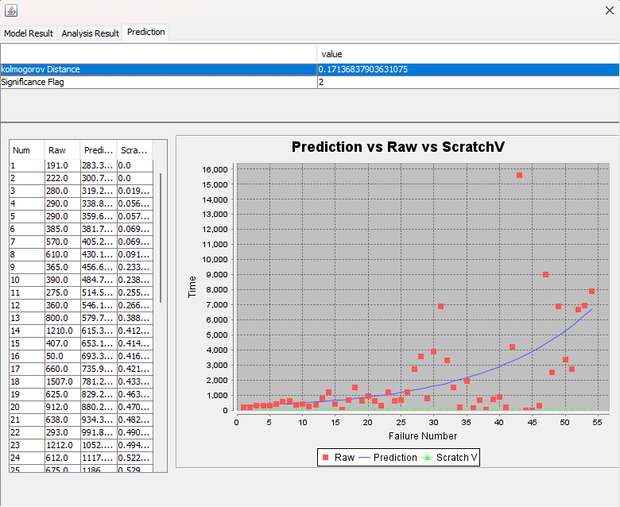
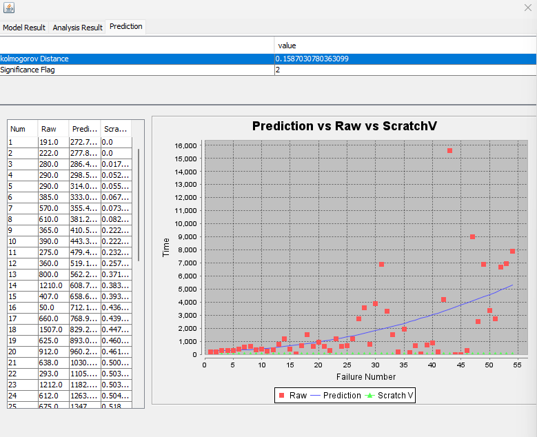

**SENG 438- Software Testing, Reliability, and Quality**

**Lab. Report \#5 – Software Reliability Assessment**

| Group: 10    |
|-----------------|
| Mohamed Ebdalla                |   
| Aryan Karadia              |   
| Raisa Rafi               |   
| Zoraiz Khan             |   

# Introduction

# 

# Assessment Using Reliability Growth Testing 

## Selected Models for Best Fit

Our model ranking is as follows:

1. Littlewood
2. Geometric

This is due to the fact that the Littlewood model has a lower Kolmogorov distance therefore it has a better "goodness-of-fit" between the two models.

## Selecting Range of Useful Data

## Displaying Graphs

Comparing the results of the Geometric model and Littlewood below, we see that the Littlewood model has a lower Kolomogorov Distance value. Littlewood has a value of `kolmogorov Distance: 0.1587030780363099` where as Geometric has a value of `kolmogorov Distance: 0.17136837903631075`.

### Geometric

### Littlewood

## Discussing Acceptable Range of Failure Rate

# Assessment Using Reliability Demonstration Chart 

# 

# Comparison of Results

# Discussion on Similarity and Differences of the Two Techniques

# How the team work/effort was divided and managed

# 

# Difficulties encountered, challenges overcome, and lessons learned

# Comments/feedback on the lab itself
