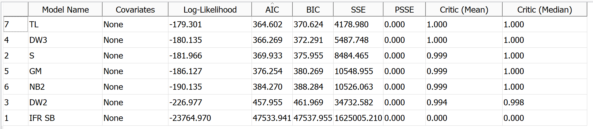
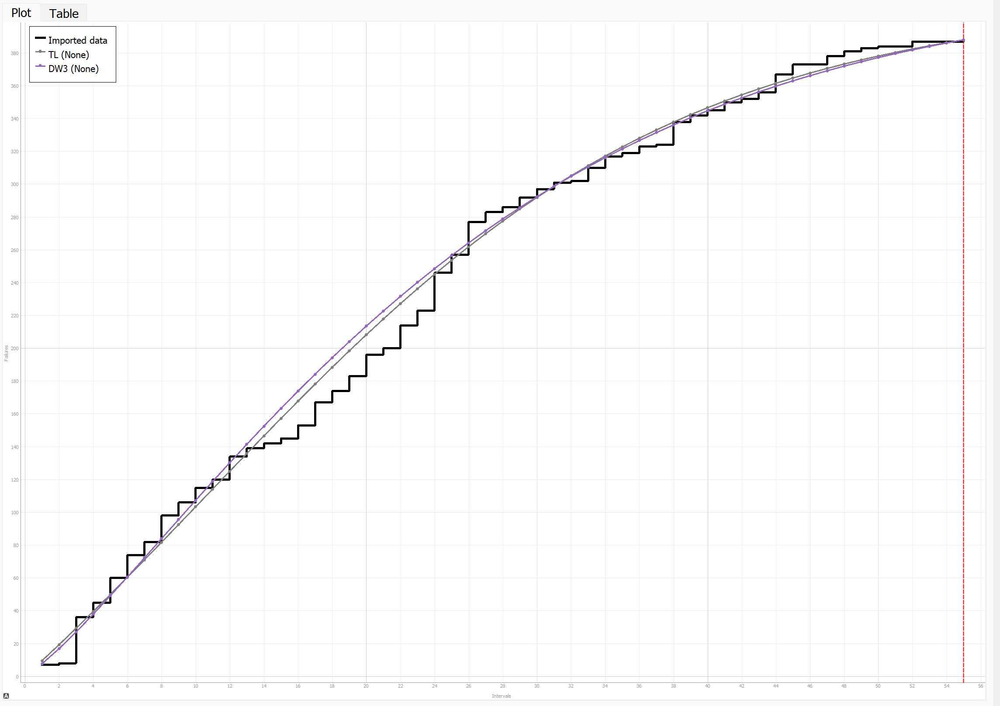
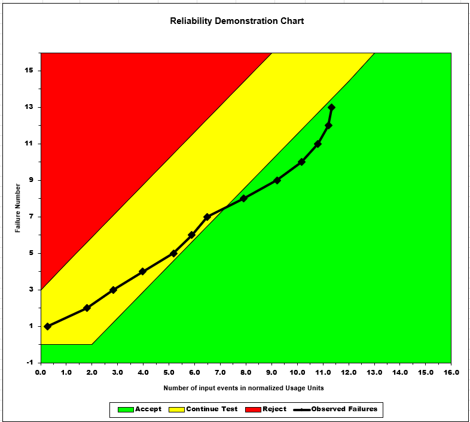
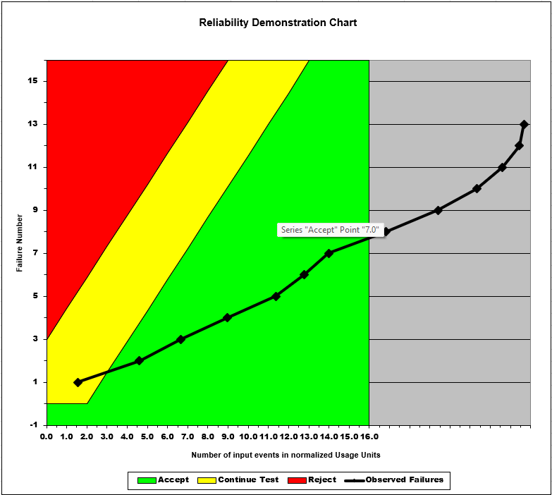
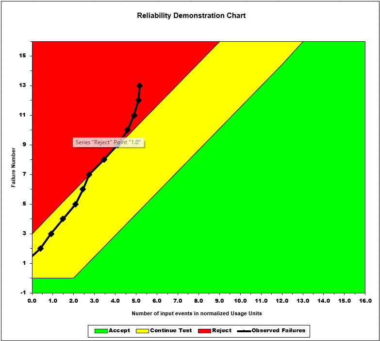

**SENG 438- Software Testing, Reliability, and Quality**

**Lab. Report \#5 – Software Reliability Assessment**

| Group: 10    |
|-----------------|
| Mohamed Ebdalla                |   
| Aryan Karadia              |   
| Raisa Rafi               |   
| Zoraiz Khan             |   

# Introduction

# 

# Assessment Using Reliability Growth Testing 

## Selected Models for Best Fit

Our model ranking is as follows:

1. Truncated Logistic
2. Discrete Weibull (Type III)

These two models had the lowest Akaike information criterion (AIC) and Bayesian Information Criteria (BIC) values when looking at the model comparisons below:

## Selecting Range of Useful Data

From our testing we found that using 70% of the data gets the best results. Using the range of data points 1-55 (70%) of the data we get the lowest AIC and BIC values without grossly overfitting to the data.

## Displaying Graphs

Here you can see both graphs displayed together onto the data.

### TL Graph

### DW3 Graph

## Discussing Acceptable Range of Failure Rate

# Assessment Using Reliability Demonstration Chart 

## MTTFmin = 0.0038

## MTTFmin half = 0.0019

## MTTFmin twice = 0.0076

# Explain your evaluation and justification of how you decide the MTTFmin

We used the "Data6.dat" file as input for failure data and we generated the reliability demonstration chart using the RDC Excel tool. We then experimented with various values for FIO, which helped us pinpoint the one where the plotted line falls just within the acceptable region of the chart. This yielded an approximate MTTFmin of 0.0038.

In the first graph, where the MTTFmin=0.0038, the line starts within the 'continue' region but gradually transitions into the acceptable region. Conversely, in the next graph where MTTFmin is halved, the line quickly enters the 'accept' region, signifying the reliablity of the SUT. And finally, upon doubling MTTFmin, the line moves into the 'reject' region, deeming it unacceptale and below the required standard.

# Comparison of Results

# Discussion on Similarity and Differences of the Two Techniques  
Some similarities between reliability growth testing and reliability demonstration charts is that they're both techniques used to assess the reliability of a system, providing information about the system's performance in terms of failure rates and mean time to failure (MTTF). Another thing in common between the two techniques is that they both use failure data collected during testing and then that data is used to analyze trends and patterns. Lastly, both techniques involve statistical analysis to interpret failure data including fitting models, calculating metrics like AIC and BIC, and determining confidence intervals.  

While both techniques are similar in what they do, they have different approaches and serve different purposes. For one, reliability growth testing focuses on the evolution of reliability over time as testing progresses while reliability demonstration charts (RDC) focus on showing whether the system meets predefined reliability targets. Reliability growth testing fits reliability growth models to failure data while RDCs plots failure data against reliability targets to determine whether or not the system meets these targets. Lastly, reliability growth testing helps to make decisions regarding further testing, identifying areas for improvement, and predicting future reliability performance while RDCs helps make decisions regarding the acceptability of the current system.

# How the team work/effort was divided and managed  
Two members attempted part 1 and other other two attempted part 2. Everybody contributed to the lab report based on the parts of the lab that they completed.

# Difficulties encountered, challenges overcome, and lessons learned  
One of the challenges we faced was formatting the input data prior to working with it. We were confused about how to format and use the data, but referred to resources online to help us. Another difficulty we encountered was trying to get SRTAT to work, so we ended up using C-SFRAT.

# Comments/feedback on the lab itself  
The lab instructions were easy to follow and were quite informative. It helped us understand how to use both reliability growth testing and reliability demonstration charts to assess system reliability, as well as the similarities/differences between the two techniques.
